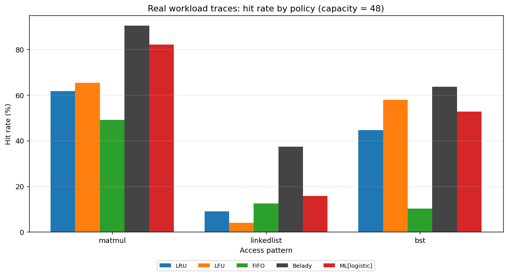

# learned-cache-sim

[](https://github.com/ShazifAhmed/Learned-Cache-Simulator/actions/workflows/ci.yml)


A cache can only hold a few things at once — like a desk that only fits a handful of
books. When it's full and you need something new, you have to put one book back on the
shelf. Which one you remove decides how often you avoid a slow trip to the shelf later.

The standard rule, used for decades, is **LRU**: remove whatever you haven't touched in
the longest time. This project asks a simple question: can a small machine-learning model
make smarter "what to remove" choices than that old rule?

The answer is yes. Trained on real programs (matrix math, following chains of links,
looking things up in a tree), the model finds the right item in the cache up to ~20% more
often than LRU — getting close to the best score that's theoretically possible. The
project also honestly shows the cases where the old rule still wins.

Everything runs with one command and produces charts, so you can see the results for
yourself.



```text
Real workload traces, cache capacity = 48 (ML trained on a held-out 60% split)
  matmul       LRU 61.7%  ->  ML 82.2%     (+20.5 pp,  Bélády ceiling 90.3%)
  bst          LRU 44.6%  ->  ML 52.8%     ( +8.2 pp,  Bélády ceiling 63.6%)
  linkedlist   LRU  9.1%  ->  ML 15.8%     ( +6.7 pp,  Bélády ceiling 37.3%)
```

> Real output from `cachesim demo`. Numbers are reproducible on your machine; see
> [Reproduce everything](#reproduce-everything).

---

## Why this is interesting

A cache keeps a small set of items fast to reach. When it fills up it must evict
something, and which item it drops decides the hit rate. LRU — evict whatever was
used longest ago — is the textbook default. It shines when the recent past predicts the
near future, and fails badly on scans/loops slightly larger than the cache, where it
throws out the very line it is about to need again.

**Belady's optimal** evicts the line reused farthest in the future. It is provably the
best policy possible — but it needs to see the future, so it cannot run for real. It is
the ceiling everything else is measured against.

This project sits in between: it learns, offline, what soon to be reused lines look
like, then applies that judgement online where the future is hidden. It is a compact,
explainable take on the "learned cache replacement" idea

## How the learned policy works

1. **Features (past only).** Each address is described by five interpretable numbers:
   recency, frequency, last reuse gap, mean reuse gap, and age — all computed purely from
   history, so the policy stays a legitimate *online* policy at decision time.
2. **Labels (training only).** On a training trace we look ahead and label each access
   `1` if that address is reused within the next `W` accesses, else `0`.
3. **Model.** A `scikit-learn` classifier (logistic regression by default; gradient
   boosting optional) learns to predict "will be reused soon."
4. **Eviction.** When the cache is full, every resident is scored and the one least
   likely to be reused soon is evicted.

The future is used *only* during training. On real traces the model is trained on a
held-out 60% split and evaluated on the unseen 40%; on synthetic traces it is trained on
a different RNG seed. Either way, the reported gain reflects **generalization, not
memorizing the test trace.**

## Reproduce everything

```bash
git clone https://github.com/ShazifAhmed/Learned-Cache-Simulator.git
cd Learned-Cache-Simulator
make install          # pip install -e ".[dev]"
make traces           # capture the real workload traces (needs a C compiler)
make demo             # benchmark every policy and regenerate all charts in results/
make test             # run the test suite
```

No `make`? The equivalent commands:

```bash
pip install -e ".[dev]"
bash scripts/capture_traces.sh
cachesim demo
pytest -q
```

Prefer a container? `docker build -t learned-cache-sim . && docker run --rm -v "$PWD/results:/app/results" learned-cache-sim`.

Target a single scenario:

```bash
cachesim run   --trace data/traces/matmul.txt --capacity 48     # a real trace
cachesim run   --pattern zipfian --capacity 64 --chart results/bars.png
cachesim sweep --pattern mixed --capacities 16,32,64,128,256 --chart results/sweep.png
```

## Where the traces come from

**Real traces (committed, reproducible).** `scripts/capture_traces.sh` compiles
`tools/gen_real_trace.c` and records the actual cache lines touched by three real
workloads — naive matrix multiply (regular strided reuse), a shuffled linked-list
traversal (pointer chasing), and random binary-search-tree lookups (skewed, root-hot
reuse). The locality is a genuine artifact of each algorithm, not a hand-picked
distribution. Small samples live in `data/traces/`.

**Synthetic traces (instant, zero downloads).** `cachesim` can also generate parametric
patterns — sequential, strided, looping, zipfian, and a phased "mixed" workload — useful
for stress-testing a specific behaviour. See the synthetic comparison below.

**Standard public traces (optional).** `scripts/download_traces.sh` points at the
canonical sets used in the literature — the ML Prefetching Competition / ChampSim traces,
the CRC2 cache-replacement championship traces, and SNIA storage I/O traces. Convert any
to one integer address per line and pass it with `--trace`.

## Synthetic stress tests

Every classic policy collapses on *some* pattern (LFU on scans, LRU on loops/scans), while
the learned policy stays near the Bélády ceiling across all of them. There is no single
classic rule you can pick that wins everywhere — but a model can learn to adapt.


| Zipfian: hit rate by policy | Mixed: hit rate vs. cache size |
| --- | --- |
|  |  |

## Honest limitations (and where LRU still wins)

A mature benchmark shows its losses, not just its wins:

- **When the working set fits, LRU is already near-optimal.** On `matmul` at capacity 64
  the data essentially fits and LRU reaches ~95%; the model's occasional bad eviction puts
  it *behind* LRU there. The learned policy helps most under memory pressure (small cache
  relative to the working set) and the edge narrows as pressure eases.
- **On pure popularity skew, plain LFU edges the model** — frequency *is* the whole signal
  on a zipfian stream. The model's value is not knowing that in advance: it adapts across
  skew, scans, loops, and phased workloads without being told which it is looking at.
- **On a perfectly uniform loop no per-line signal exists**, so no recency/frequency model
  can beat committing to a fixed subset (which is what Bélády does).

Other simplifications: the cache is **fully associative** with a uniform miss cost (this
isolates the replacement *decision* from set-associativity and latency tiers); Bélády is
an **oracle upper bound**, not a runnable policy; and scoring residents is `O(residents)`
per miss — fine at these trace sizes, and an obvious place a production design would batch.

## Project layout

```
src/cachesim/
  trace.py        # synthetic trace generators + trace I/O
  policies.py     # LRU, LFU, FIFO, Belady (a shared Strategy interface)
  features.py     # online feature extraction for the learned policy
  ml_policy.py    # the learned replacement policy (train + infer)
  simulator.py    # the cache + the single simulation loop, hit/miss metrics
  benchmark.py    # run all policies on a trace; sweep capacities
  plotting.py     # bar + line charts (headless-safe)
  cli.py          # `cachesim` command-line entrypoint
tools/            # gen_real_trace.c — instrumented workloads that emit real traces
scripts/          # capture_traces.sh (real) and download_traces.sh (public sets)
tests/            # pytest suite (policies, simulator, ML behaviour, I/O)
.github/workflows # CI: ruff + pytest on Python 3.10–3.12
```

The test suite pins the project's central claim as an executable test
(`test_ml_beats_lru_on_skewed_workload`): trained and evaluated on different seeds, the
learned policy must beat LRU on a skewed workload.

## License

MIT — see [LICENSE](LICENSE).
