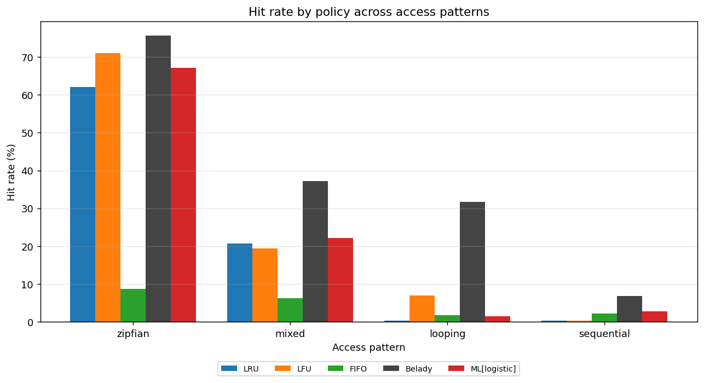
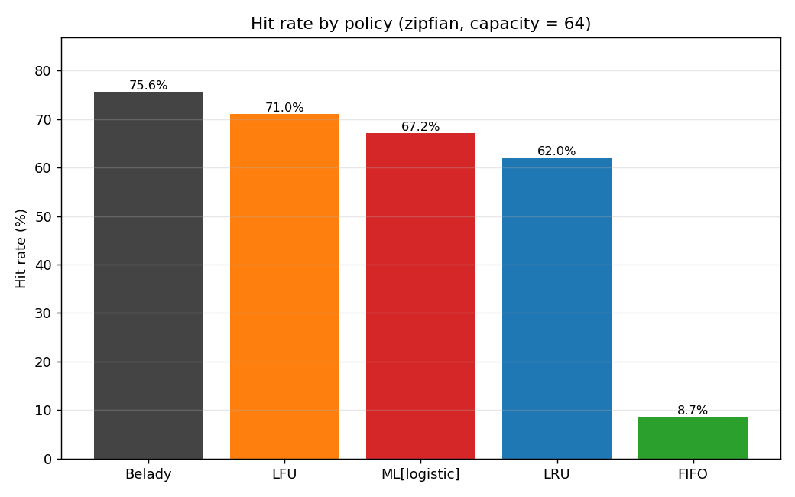
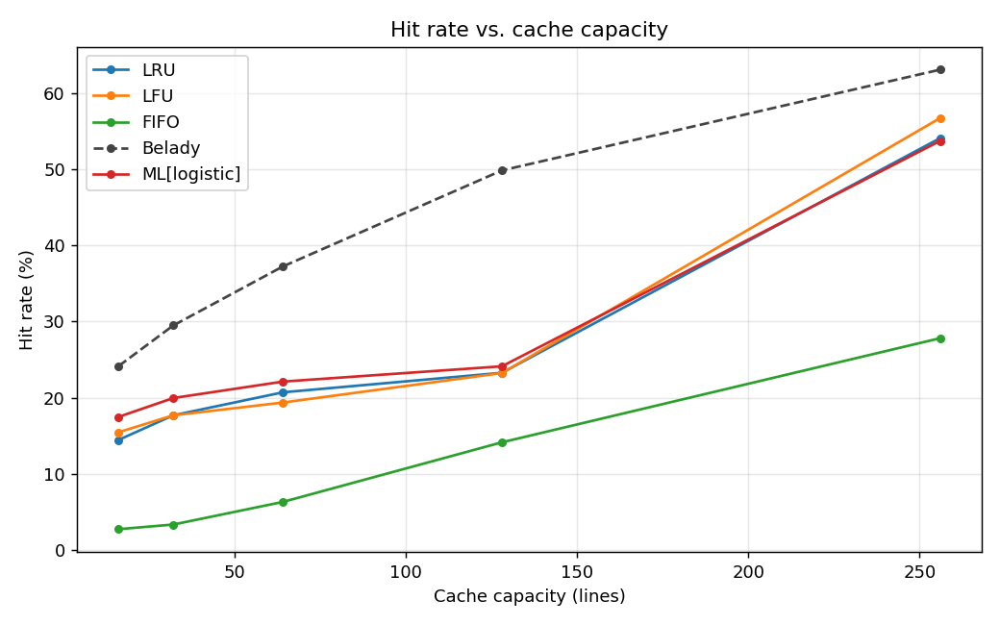

# learned-cache-sim

[](https://github.com/USERNAME/learned-cache-sim/actions/workflows/ci.yml)


A cache-replacement simulator that benchmarks a **small learned predictor** against the
classic policies — **LRU, LFU, FIFO** — and against **Bélády's optimal** (the provable
upper bound). Same trace, same cache size, head-to-head hit rates, with charts.

The question it answers: *can a lightweight machine-learning model make better eviction
decisions than the decades-old "least recently used" rule?* On patterned access streams,
it can — and this repo measures exactly by how much.

```text
[demo] pattern=zipfian capacity=64
  Belady             hit_rate=75.58%   <- optimal upper bound (oracle)
  LFU                hit_rate=71.05%
  ML[logistic]       hit_rate=67.17%   <- learned
  LRU                hit_rate=62.02%
  FIFO               hit_rate= 8.69%

  ML is 5.15 percentage points above LRU.
```

> Real output from `cachesim demo`. The learned policy beats LRU on **every** access
> pattern tested (see the chart below); the gap is largest under skew and memory
> pressure. Run `cachesim demo` to reproduce these numbers and regenerate `results/`.

---

## Why this is interesting

A cache keeps a small set of items fast to reach. When it fills up, it must evict
something to make room, and *which* item it drops decides the hit rate. **LRU** — evict
whatever was used longest ago — is the textbook default. It's great when the recent past
predicts the near future, and terrible on scans/loops slightly larger than the cache,
where it throws out the very line it's about to need again.

**Bélády's optimal** evicts the line reused farthest in the future. It's provably the
best policy possible — but it needs to see the future, so it can't run for real. It's the
ceiling everything else is measured against.

This project sits in between: it learns, *offline*, what soon-to-be-reused lines look
like, then applies that judgement *online* where the future is hidden. It's a compact,
explainable take on the "learned cache replacement" idea (cf. Hawkeye / Learning Bélády).

## How the learned policy works

1. **Features (past only).** Each address is described by five interpretable numbers:
   recency, frequency, last reuse gap, mean reuse gap, and age. All are computed purely
   from history, so the policy stays a legitimate online policy at decision time.
2. **Labels (training only).** On a *training* trace we look ahead and label each access
   `1` if that address is reused within the next `W` accesses, else `0`.
3. **Model.** A `scikit-learn` classifier (logistic regression by default; gradient
   boosting optional) learns to predict "will be reused soon."
4. **Eviction.** When the cache is full, every resident is scored and the one least
   likely to be reused soon is evicted.

Training is the only place the future is used. By default the CLI **trains and evaluates
on different random seeds**, so the reported gain reflects generalization, not memorizing
one trace.

## Quickstart

```bash
git clone https://github.com/USERNAME/learned-cache-sim.git
cd learned-cache-sim
pip install -e ".[dev]"      # installs the package + pytest/ruff

# One command: generate traces, benchmark every policy, write charts to results/
cachesim demo

# Or target a specific scenario
cachesim run   --pattern looping --working-set 80 --capacity 64 --chart results/bars.png
cachesim sweep --pattern mixed --capacities 16,32,64,128,256 --chart results/sweep.png
```

### Results (after `cachesim demo`)

The headline figure — every classic policy collapses on *some* pattern (LFU on scans,
LRU on loops/scans), while the learned policy stays near the Bélády ceiling across all of
them. That robustness across regimes is the point: there is no single classic rule you
can pick that wins everywhere, but a model can learn to.



| Zipfian: hit rate by policy | Mixed: hit rate vs. cache size |
| --- | --- |
|  |  |

On pure zipfian, plain LFU edges out the model — frequency *is* the whole signal there.
The learned policy's advantage is that it doesn't need you to know that in advance: it
adapts to skew, scans, loops, and the phased "mixed" workload without being told which
one it's looking at. The capacity sweep also shows the gain over LRU is largest when the
cache is small relative to the working set, and narrows as pressure eases.

## Using real traces

The repo is synthetic-first so it runs instantly with zero downloads. To benchmark on
real-world data instead, see `scripts/download_traces.sh` for pointers to the standard
public sets (the ML Prefetching Competition / ChampSim traces, the CRC2 replacement
championship traces, and SNIA storage I/O traces). Convert any of them to one integer
address per line and run:

```bash
cachesim run --trace data/traces/your_trace.txt --capacity 128
```

## Project layout

```
src/cachesim/
  trace.py        # synthetic trace generators + trace I/O
  policies.py     # LRU, LFU, FIFO, Belady (the Strategy interface)
  features.py     # online feature extraction for the learned policy
  ml_policy.py    # the learned replacement policy (train + infer)
  simulator.py    # the cache + the single simulation loop, hit/miss metrics
  benchmark.py    # run all policies on a trace; sweep capacities
  plotting.py     # bar + line charts (headless-safe)
  cli.py          # `cachesim` command-line entrypoint
tests/            # pytest suite (policies, simulator, ML behaviour, I/O)
.github/workflows # CI: lint + tests on Python 3.9–3.12
```

## Development

```bash
pip install -e ".[dev]"
pytest            # run the test suite
ruff check src tests
```

The test suite includes the project's central behavioural claim as an executable test
(`test_ml_beats_lru_on_looping_pattern`): the learned policy must match or beat LRU on a
working set larger than the cache.

## Design notes & honest limitations

- The cache is **fully associative** with a uniform miss cost; this isolates the
  replacement *decision* from hardware details like set associativity and latency tiers.
- Bélády is included as an **oracle upper bound**, not a runnable policy.
- The ML model is intentionally small and explainable. The point is a clean, defensible
  demonstration of learned replacement — not a state-of-the-art accelerator.
- Scoring residents at each eviction is `O(residents)` per miss; fine for the trace sizes
  here, and an obvious place a production design would amortize or batch.

## License

MIT — see [LICENSE](LICENSE).
